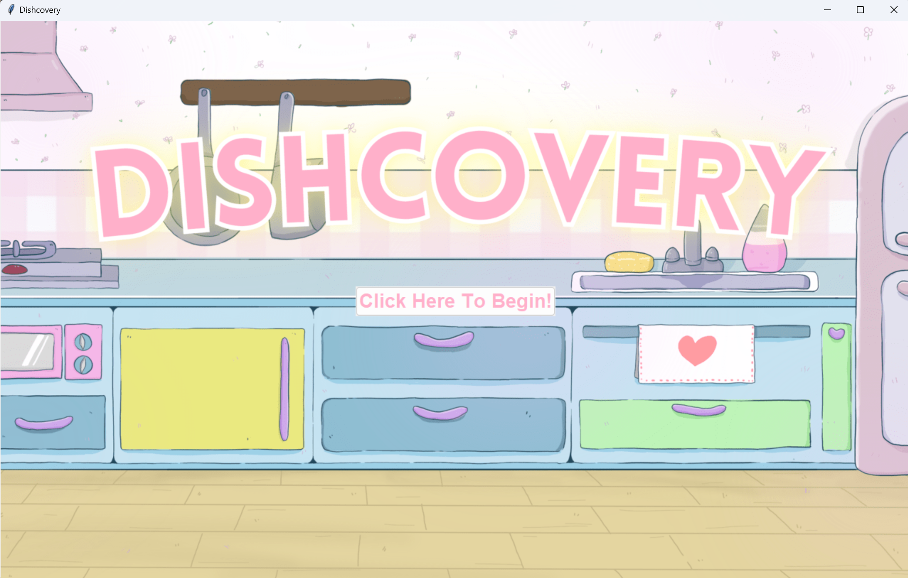
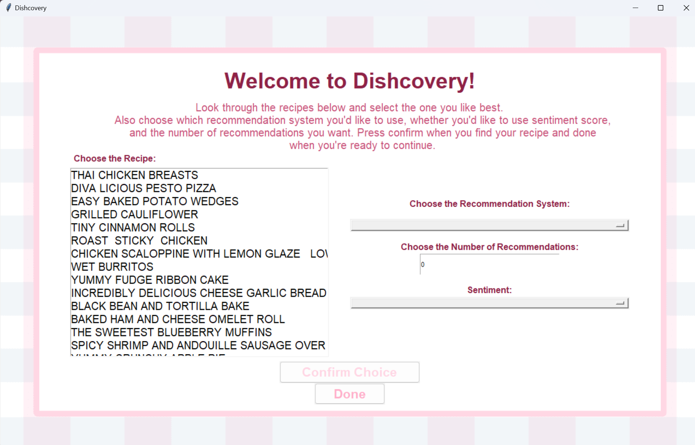
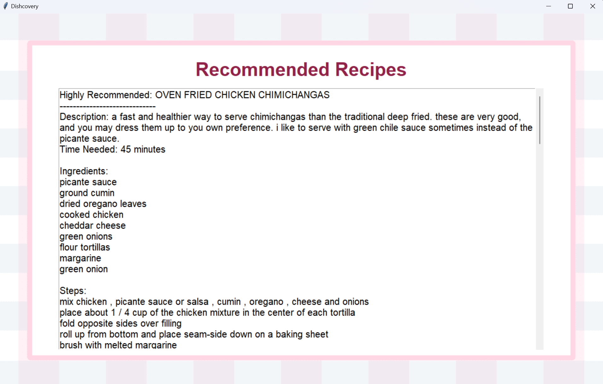

# Dishcovery

A recipe discovery application implementing range of recommendation systems for graph databases. Refer to the [report](Project_2_Final_Report_CSC111.pdf) for more information.

# How to run the application
1. Install the required libraries by running `pip install -r requirements.txt`
2. Start the application by running `python project/main.py`
   - If there are issues with NLTK, see section <ins>4: Instructions for use</ins> in the [report](Project_2_Final_Report_CSC111.pdf) detailed instructions
3. Press "Click Here To Begin" on the starting screen (seen above)
4. Select a recommendation system, number of recommendations and sentiment
5. Then, choose your preferred recipe and confirm your choice
6. The recommended recipes will be displayed from most recommended to least

Option Selection           |  Recommended Recipes
:-------------------------:|:-------------------------:
      |  

For more information on running specific recommendation systems, such as Simrank, Simrank++ and Pagerank, see section <ins>3: Computational Overview</ins> in the [report](Project_2_Final_Report_CSC111.pdf).
